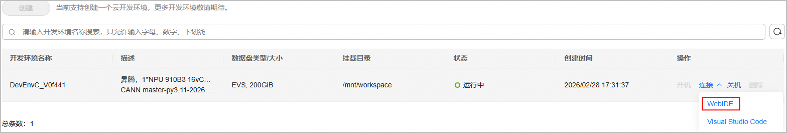

# Quick Start

## 🛠️ Environment Preparation<a name="prepare-install"></a>

Select the corresponding environment setup method according to **whether local NPU devices are available** and your usage goals:

<table>
  <thead>
    <tr>
      <th align="center">Environment Option</th>
      <th align="center">Community Evaluation / Operator Development (CANN Commercial / Community Release)</th>
      <th align="center">Ecosystem Developer Contribution (CANN master)</th>
    </tr>
  </thead>
  <tbody>
    <tr>
      <td align="center"><strong>No NPU Device</strong></td>
      <td align="center" colspan="2"><a href="#cloud-dev-env">Cloud Development Environment</a> + <a href="#cann-install">Manual CANN Package Download & Installation</a></td>
    </tr>
    <tr>
      <td align="center"><strong>NPU Device Available</strong></td>
      <td align="center"><a href="#cann-docker-image">Official CANN Docker Image</a></td>
      <td align="center"><a href="#cann-install">Manual CANN Package Download & Installation</a></td>
    </tr>
  </tbody>
</table>

> [!TIP]
> Recommendations
>
> - For stable development experience, it is recommended to prepare your environment using **containerization technology**.
> - If you prefer not to use containers, you may set up the environment on a physical machine equipped with NPUs. Refer to [CANN Software Installation Guide - Physical Machine Installation](https://www.hiascend.com/cann/download).
> - Users who only intend to compile this open-source repository and perform compilation verification of samples do not require local NPUs. You can skip NPU driver and firmware deployment and directly install the CANN package; see [Download and Install CANN Package](#cann-install).
> - The `hcomm_write_read_nbi` sample requires at least two NPUs for runtime execution.

### 1️⃣ Cloud Development Environment<a name="cloud-dev-env"></a>

Users without physical NPU hardware can directly use the **CANNLab Cloud Development Environment**, a one-stop development platform. It provides an online ready-to-run Ascend ARM environment with pre-installed drivers, firmware, software packages and dependencies without manual setup. This platform currently supports Atlas A2 series products and offers two access methods:

- **WebIDE**: Lightweight web-based development experience.
- **VSCode IDE**: Supports remote connection to the cloud development environment with full access to the VSCode extension marketplace.

1. Navigate to the GitCode repository page, click `CANNLab > Cloud Dev`, and log in with your authenticated Huawei Cloud account. Complete registration and authentication following page prompts if you have not done so.

   <p align="center"></p>

2. Create an NPU environment and configure specifications following page instructions. After launching the cloud environment, click `Connect > WebIDE or Visual Studio Code` to enter the one-stop platform. Repository resources are located under `/mnt/workspace` by default.

   <p align="center"></p>

> [!NOTE]
> Usage Notes
>
> - The environment comes with the latest commercial NPU driver, firmware and CANN packages. Match your source code version with installed software.
> - If you need a specific CANN release, refer to [Download and Install CANN Package](#cann-install).
> - For more details about **CANNLab Cloud Development Environment**, see [CANNLab Guide](https://gitcode.com/org/cann/discussions/54).
> - The [Huawei Developer Space Extension](https://marketplace.visualstudio.com/items?itemName=HuaweiCloud.developerspace) enables VSCode IDE connectivity to the cloud environment.

### 2️⃣ Official CANN Docker Image<a name="cann-docker-image"></a>

Users with physical NPU hardware can develop with the official CANN Docker image.

1. Verify host prerequisites
   - Confirm NPU driver and firmware are installed. Run `npu-smi info` to check device status. If missing, follow the sections *Prepare Software Packages* and *Install NPU Driver and Firmware* in the [CANN Software Installation Guide](https://www.hiascend.com/document/redirect/CannCommunityInstWizard). Drivers and firmware are runtime dependencies; you may skip them if only compiling source code.
   - Confirm Docker is installed. Run `docker --version` to verify. If missing, follow the [official Docker installation guide](https://docs.docker.com/engine/install/).

2. Pull the CANN image
    Fetch the pre-integrated CANN image from the Ascend Hub repository:

    ```bash
    # Example: CANN community package tag 9.0.0-beta.2
    # docker pull swr.cn-south-1.myhuaweicloud.com/ascendhub/cann:9.0.0-beta.2-910b-ubuntu22.04-py3.11
    docker pull <ascend/cann:tag>
    ```

    > [!NOTE]
    > Usage Notes
    > - The image contains the corresponding CANN release. Match your source code with the software version.
    > - Image size is large; downloading normally takes 5–10 minutes under standard network conditions.

3. Launch the Docker container
    After pulling the image, start the container with dedicated parameters to grant access to host NPUs.

    ```bash
    docker run --name <cann_container> \
        --ipc=host --net=host --privileged \
        --device /dev/davinci0 \
        --device /dev/davinci1 \
        --device /dev/davinci_manager \
        --device /dev/devmm_svm \
        --device /dev/hisi_hdc \
        -v /usr/local/dcmi:/usr/local/dcmi \
        -v /usr/local/bin/npu-smi:/usr/local/bin/npu-smi \
        -v /usr/local/Ascend/driver/lib64/:/usr/local/Ascend/driver/lib64/ \
        -v /usr/local/Ascend/driver/version.info:/usr/local/Ascend/driver/version.info \
        -v /etc/ascend_install.info:/etc/ascend_install.info \
        -v </home/your_host_dir>:</home/your_container_dir> \
        -it <ascend/cann:tag> bash
    ```

    | Parameter | Description | Remarks |
    | :--- | :--- | :--- |
    | `--name <cann_container>` | Assign a custom name for container management | User-defined |
    | `--ipc=host` | Share IPC namespace with host; required for NPU inter-process communication (shared memory, semaphores) | - |
    | `--net=host` | Use host network stack to avoid communication latency from container forwarding | - |
    | `--privileged` | Grant full device access permissions required for NPU driver operation | - |
    | `--device /dev/davinci<N>` | Map specified NPU device into the container; repeat the argument to attach multiple NPUs | Adjust device index according to `npu-smi info`. At least two Ascend 950PR/Ascend 950DT devices shall be mapped to run the `hcomm_write_read_nbi` sample. |
    | `--device /dev/davinci_manager` | Mount NPU device management interface | - |
    | `--device /dev/devmm_svm` | Mount device memory management interface | - |
    | `--device /dev/hisi_hdc` | Mount host-device communication interface | - |
    | `-v /usr/local/dcmi:/usr/local/dcmi` | Mount DCMI tools and libraries for device management | - |
    | `-v /usr/local/bin/npu-smi:/usr/local/bin/npu-smi` | Mount `npu-smi` utility | Enables querying NPU status and performance inside the container |
    | `-v /usr/local/Ascend/driver/lib64/:/usr/local/Ascend/driver/lib64/` | Map host NPU driver libraries into container | - |
    | `-v /usr/local/Ascend/driver/version.info:/usr/local/Ascend/driver/version.info` | Mount driver version file | - |
    | `-v /etc/ascend_install.info:/etc/ascend_install.info` | Mount CANN installation metadata file | - |
    | `-v </home/your_host_dir>:</home/your_container_dir>` | Mount a host directory into the container | User-defined |
    | `-it` | Combined `-i` (interactive) and `-t` (pseudo-TTY) flags | - |
    | `<ascend/cann:tag>` | Target Docker image name and tag | Must exactly match the tag used in `docker pull` |
    | `bash` | Command executed immediately after container startup | - |

### 📥 Download and Install CANN Package<a name="cann-install"></a>

CANN packages include the CANN toolkit package and CANN ops package.

#### Download CANN Packages

1. <a name="download-cann-commercial-community"></a>Download CANN Commercial / Community Release
    To use officially published CANN builds, visit [CANN Download Page - Ascend Community](https://www.hiascend.com/cann/download) to obtain the corresponding release.

2. <a name="download-cann-master"></a>Download CANN master
    To test CANN master branch builds, visit the [CANN master OBS mirror website](https://ascend.devcloud.huaweicloud.com/artifactory/cann-run-mirror/software/master) and download the most recent CANN packages by date.

#### Install CANN Packages

1. Install CANN toolkit package (Mandatory)

    ```bash
    chmod +x Ascend-cann-toolkit_${cann_version}_linux-$(uname -m).run
    ./Ascend-cann-toolkit_${cann_version}_linux-$(uname -m).run --install --install-path=${install_path}
    ```

2. Install CANN ops package (Optional)

    ```bash
    chmod +x Ascend-cann-${soc_name}-ops_${cann_version}_linux-$(uname -m).run
    ./Ascend-cann-${soc_name}-ops_${cann_version}_linux-$(uname -m).run --install --install-path=${install_path}
    ```

    > [!IMPORTANT]
    > Installation Note
    > The [AIV direct-driven URMA Hcomm sample](../examples/hcomm_write_read_nbi/README_en.md) does not depend on the ops package. Install it later only when you require features relying on the operator package.

| Parameter | Description |
| :--- | :--- |
| `${cann_version}` | CANN package version string |
| `${soc_name}` | NPU model name, e.g. `910b` |
| `${install_path}` | Installation directory. Toolkit and ops packages must share the same path. Default: `/usr/local/Ascend` for root users, `$HOME/Ascend` for non-root users |

## ✅ Environment Verification<a name="cann-verify"></a>
>
> [!NOTE]
> Precondition
> The cloud development environment and official CANN Docker images come with pre-installed CANN packages; you may directly execute the verification commands.

Verify environment and driver health:

- **Check NPU devices**:

    ```bash
    # Normal output indicates functional drivers
    npu-smi info
    ```

- **Check CANN package installation**:

    ```bash
    # View CANN Toolkit version info (default installation path)
    cat /usr/local/Ascend/cann/$(uname -m)-linux/ascend_toolkit_install.info
    ```

## ⚡ Environment Variable Setup<a name="cann-env-setup"></a>
>
> [!NOTE]
> Precondition
> Cloud development environments and official CANN Docker images configure environment variables automatically; skip this section.

Select the corresponding command to load environment variables:

```bash
# Default installation path (root user example; replace /usr/local with ${HOME} for non-root users)
source /usr/local/Ascend/cann/set_env.sh
# Custom installation path
# source ${install_path}/cann/set_env.sh
```

## 🔨 Source Compilation Steps<a name="source-build"></a>

### 📥 Clone Source Code<a name="source-download"></a>

Clone this repository:

```bash
git clone https://gitcode.com/cann/asc-comm.git
cd asc-comm
```

### 📦 Dependency Check<a name="dependency-check"></a>
>
> [!NOTE]
> Precondition
> If you use **containerization technology**, required dependencies are pre-installed inside the container and this step can be skipped.

Prerequisites for source compilation and UT validation:

- python >= 3.7.0
- gcc/g++ with C++17 support
- cmake >= 3.16.0

### ⚡ Build Source Code<a name="compile-install"></a>

Enter repository root and execute:

```bash
bash build.sh
```

### 🧪 Unit Test Verification<a name="ut-verify"></a>

#### Dependency Preparation

UTs depend on googletest. If system GTest is unavailable, point `CANN_3RD_LIB_PATH` to the CANN third-party directory.

#### Run UTs

Option 1: Build Hcomm UTs from repository root

```bash
bash build.sh -t
```

Specify the CANN third-party directory when needed:

```bash
bash build.sh -t --cann_3rd_lib_path=<path-to-third-party>
```

Option 2: Direct CMake invocation with offline GTest path

```bash
cmake -S tests/ut -B build/ut-hcomm -DCANN_3RD_LIB_PATH=<path-to-third-party>
cmake --build build/ut-hcomm
```

#### Open-Source Third-Party Dependencies

Third-party open-source software used for UT execution:

| Software | Version |
| :---: | :---: |
| googletest | 1.14.0 |

### 🧩 Sample Verification<a name="sample-verify"></a>

[hcomm_write_read_nbi](../examples/hcomm_write_read_nbi/README_en.md) provides a point-to-point communication sample using AIV direct-driven URMA `WriteNbi` and `ReadNbi`.
The sample supports Ascend 950PR / Ascend 950DT and requires CANN 9.1.0 or newer. At least two NPUs are required for runtime; single-NPU environments only support compilation verification.

Navigate to the sample directory and run:

```bash
source /usr/local/Ascend/cann/set_env.sh
cd examples/hcomm_write_read_nbi
mkdir -p build
cd build
cmake -DCMAKE_ASC_ARCHITECTURES=dav-3510 ..
make -j
./demo
```

Successful execution outputs:

```text
rank 0 test pass!
rank 1 test pass!
test pass!
```
